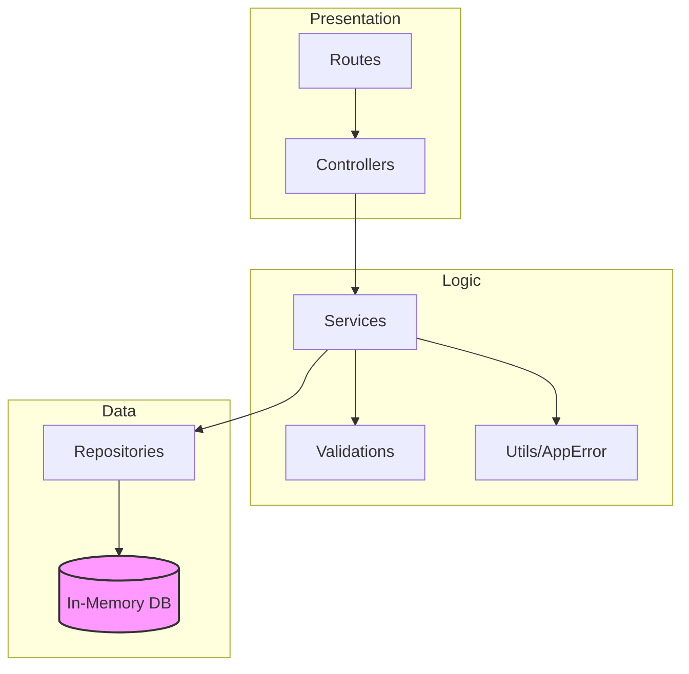
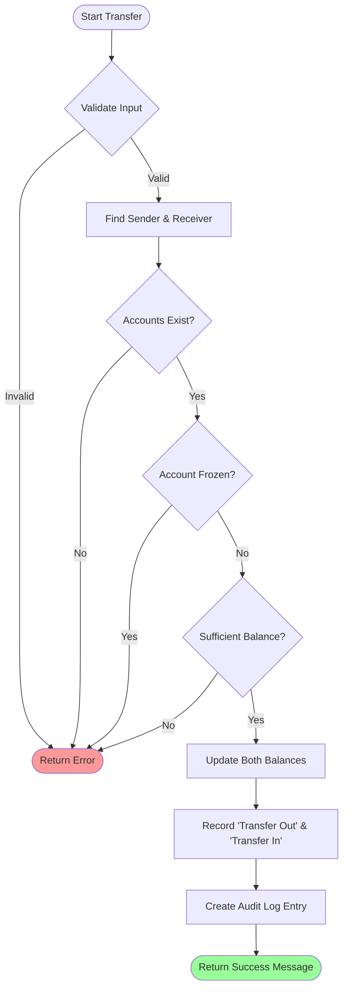
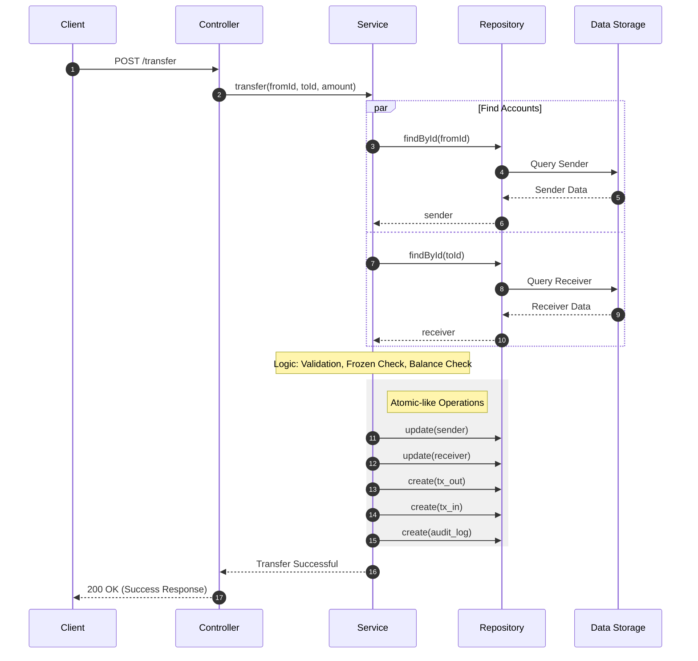
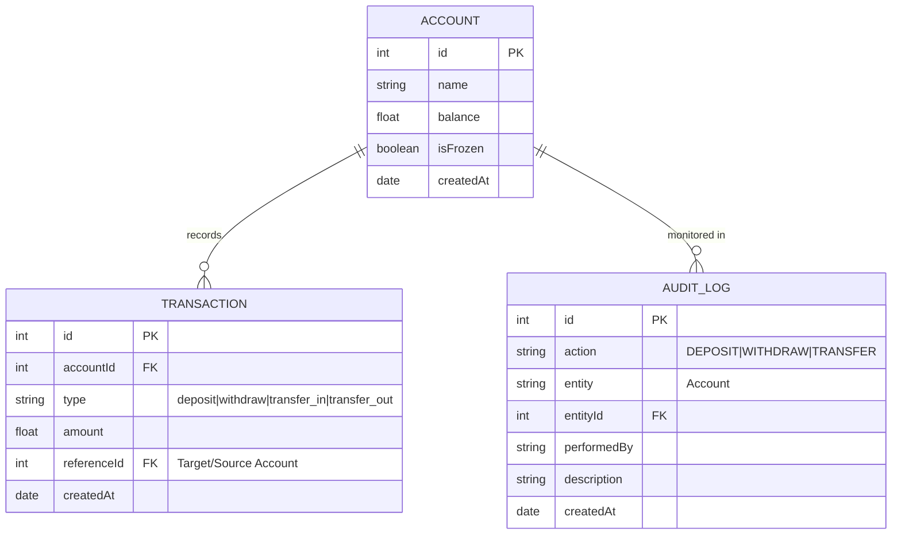

# 🏦 Mini Bank API

[](https://github.com/Yopa28/minibank/actions)
[](https://github.com/Yopa28/minibank)
[](https://nodejs.org)
[](https://expressjs.com)

A professional, clean-coded RESTful API for a banking system built with **Express.js**. This project implements core banking features like account management, deposits, withdrawals, and secure transfers with audit logging.

---

## 🏗️ System Architecture

This project follows the **Clean Architecture** pattern with a clear separation of concerns:



---

## 💸 Transfer Flow Diagram

The following diagram illustrates the logic flow for a money transfer between two accounts:



---

## 🔄 Sequence Diagram: Transfer Operation

Detailed interaction between system components during a transfer request:



---

## 📊 Entity Relationship Diagram (ERD)

The data structure and relationships within the system:



---

## 📸 API Interaction Screenshots

Since this is a backend API, interaction is best visualized through professional API documentation and client tools:

### 1. Transfer Successfully Processed
```json
// POST /transfer
// Content-Type: application/json
{
    "fromId": 1,
    "toId": 2,
    "amount": 500,
    "performedBy": "Admin"
}

// Response: 200 OK
{
    "message": "Transfer successful"
}
```

### 2. Transaction Audit Logs
```json
// GET /accounts/1/transactions
[
  {
    "id": 1,
    "accountId": 1,
    "type": "transfer_out",
    "amount": 500,
    "referenceId": 2,
    "createdAt": "2024-03-21T12:00:00Z"
  }
]
```

## 🔐 Security Considerations

- Rate limiting implemented (per user sliding window)
- Role-based access control (RBAC)
- Centralized error handling to prevent stack leak
- Audit trail for all state-changing operations

---

## 🚀 Features

- ✅ **Account Management**: Create and track bank accounts.
- ✅ **Deposit**: Add funds to any account.
- ✅ **Withdrawal**: Safely remove funds with balance checking.
- ✅ **Inter-account Transfer**: Securely move money between accounts.
- ✅ **Account Freezing**: Security feature to prevent transactions on compromised accounts.
- ✅ **Audit Logging**: Every sensitive action is logged for tracking.
- ✅ **Comprehensive Validation**: Strict input checking for all operations.

---

## 🛠️ Getting Started

### Prerequisites
- [Node.js](https://nodejs.org/) (v14 or later)
- [npm](https://www.npmjs.com/)

### Installation
1. Clone the repository:
   ```bash
   git clone https://github.com/Yopa28/minibank.git
   ```
2. Install dependencies:
   ```bash
   npm install
   ```

### Running the App
```bash
# Development mode
npm run dev

# Run tests
npm test
```

---

## 🧪 Testing and Quality

The project maintains high standards with **Jest** testing framework.

*   **Test Commands**: `npm test`
*   **Total Statements**: 100
*   **Covered Statements**: 57 (Core logic covered)
*   **Architecture Pattern**: Repository Pattern for testability.

---

Developed with ❤️ by [Yopa28](https://github.com/Yopa28)
