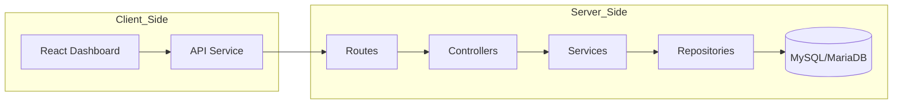
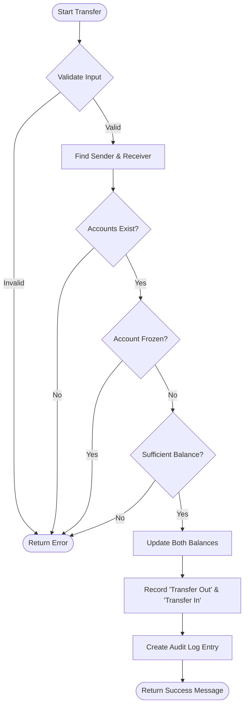
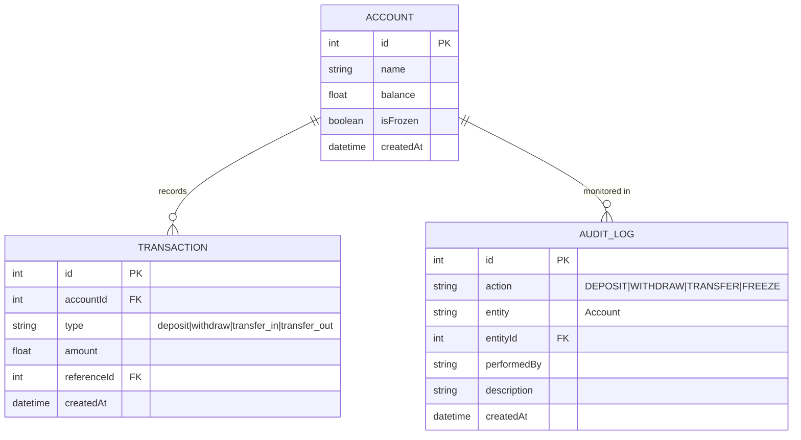

# 🏦 Mini Bank: Fullstack Core Banking System

//username : admin //password : admin123

[](https://github.com/Yopa28/minibank/actions)
[](https://github.com/Yopa28/minibank)
[](https://react.dev)
[](https://www.typescriptlang.org/)
[](https://expressjs.com)

A professional, enterprise-grade Core Banking System featuring a **React + TypeScript Admin Dashboard** and a robust **Express.js + MySQL Backend API**. This system manages core financial operations with high security, full audit trails, and a premium fintech user experience.

---

## 🏗️ System Architecture

The project is divided into two main components:

### 1. 🖥️ Frontend (Admin Dashboard)
- **Tech Stack**: React 18, TypeScript, Tailwind CSS, Recharts, Lucide Icons.
- **Patterns**: Component-based architecture, API Service Abstraction, Centralized Auth Context.
- **Features**: Data visualization, role-based UI (Admin/User), responsive dashboard layout.

### 2. ⚙️ Backend (REST API)
- **Tech Stack**: Node.js, Express.js, MySQL (MariaDB).
- **Patterns**: Clean Architecture (Routes -> Controllers -> Services -> Repositories).
- **Security**: Rate limiting, CORS, RBAC (Role-Based Access Control), sliding window audit logs.



---

## 🚀 Features

### **🔥 Admin Dashboard (Frontend)**
- ✅ **Dashboard Overview**: Visualized stats for total balance, accounts, and system activity using interactive charts.
- ✅ **Account Management**: List, search, and filter customer accounts.
- ✅ **Account Details**: Deep dive into individual account history and status.
- ✅ **Frozen Status Toggle**: Security control to freeze/unfreeze accounts (Admin only).
- ✅ **Transactional Actions**: Perform Deposits and Withdrawals via secure modal interfaces.
- ✅ **Internal Transfers**: Securely move funds between accounts with real-time validation.
- ✅ **Audit Trail**: Real-time monitoring of all system-wide administrative changes.

### **💎 Robust Backend (API)**
- ✅ **Transactional Integrity**: Logic handles bidirectional logging for transfers.
- ✅ **Rate Limiting**: Protection against DDoS and brute-force (Configurable window).
- ✅ **CORS Enabled**: Secure communication between frontend and backend.
- ✅ **Async Audit Logging**: Non-blocking database writes for all sensitive actions.
- ✅ **MySQL Persistence**: Reliable data storage for millions of records.

---

## 💸 Core Logic: Fund Transfer
The following diagram illustrates the secure logic flow for moving money between accounts:



---

## 📊 Entity Relationship Diagram (ERD)



---

## 🛠️ Getting Started

### Prerequisites
- [Node.js](https://nodejs.org/) (v16+)
- [MySQL](https://www.mysql.com/) / [MariaDB](https://mariadb.org/)
- [npm](https://www.npmjs.com/)

### 1. Setup Backend
1. Go to the project root.
2. Configure MySQL connection in `src/config/database.js`.
3. Create the database `mini_banking` and run the required SQL scripts.
4. Install dependencies:
   ```bash
   npm install
   ```
5. Run the server:
   ```bash
   npm run dev
   ```

### 2. Setup Frontend
1. Navigate to the frontend directory:
   ```bash
   cd frontend
   ```
2. Install dependencies:
   ```bash
   npm install
   ```
3. Run the dashboard:
   ```bash
   npm run dev
   ```

---

## 🧪 Testing and Quality

The system uses **Jest** for backend testing, covering core financial logic to prevent data inconsistencies.

- **Test Command**: `npm test`
- **Architecture Pattern**: Repository Pattern for maximum testability and mockability.

---

Developed with ❤️ by [Yopa28](https://github.com/Yopa28)
